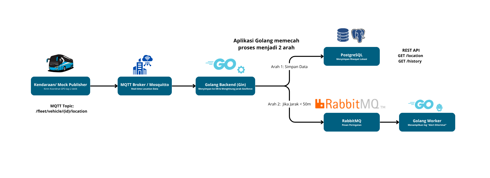

# Fleet Management System - Transjakarta Technical Test

Backend Fleet Management System yang dibangun menggunakan **Golang**, **Gin**, **PostgreSQL**, **MQTT (Mosquitto)**, dan **RabbitMQ**. Sistem ini menerima data lokasi kendaraan secara real-time melalui MQTT, menyimpannya ke PostgreSQL, menyediakan REST API untuk monitoring lokasi kendaraan, serta menghasilkan event geofence menggunakan RabbitMQ.

---

# Features

### 1. MQTT Subscriber

Menerima data lokasi kendaraan secara real-time melalui MQTT Topic:

```text
/fleet/vehicle/{vehicle_id}/location
```

### 2. PostgreSQL Storage

Menyimpan seluruh histori lokasi kendaraan ke database PostgreSQL.

### 3. REST API

Menyediakan endpoint untuk:

* Mendapatkan lokasi terakhir kendaraan.
* Mendapatkan riwayat perjalanan kendaraan berdasarkan rentang waktu.

### 4. Geofence Detection

Menggunakan Rumus Haversine untuk menghitung jarak kendaraan terhadap titik geofence.

Jika kendaraan berada dalam radius ≤ 50 meter dari titik geofence, sistem akan mengirim event ke RabbitMQ.

### 5. RabbitMQ Event Processing

Mengirim dan memproses event geofence menggunakan RabbitMQ Exchange dan Queue.

---

# Technology Stack

| Component        | Technology              |
| ---------------- | ----------------------- |
| Language         | Golang 1.24+            |
| Web Framework    | Gin Gonic               |
| Database         | PostgreSQL 16           |
| MQTT Broker      | Eclipse Mosquitto       |
| Message Queue    | RabbitMQ 3 Management   |
| Database Driver  | pgxpool                 |
| Containerization | Docker & Docker Compose |

---

# System Architecture



Flow aplikasi:

1. Mock Publisher mengirim data GPS kendaraan ke MQTT Broker (Mosquitto).
2. Backend Golang menerima data melalui MQTT Subscriber.
3. Data lokasi disimpan ke PostgreSQL.
4. Backend melakukan pengecekan Geofence menggunakan Rumus Haversine.
5. Jika kendaraan memasuki area geofence, backend mengirim event ke RabbitMQ.
6. RabbitMQ Worker memproses event geofence.
7. REST API menyediakan akses ke lokasi terakhir dan histori kendaraan.

---

# Project Structure

```text
fleet-management/
├── cmd
│   ├── api                 # Entry point backend API
│   └── publisher           # Mock GPS Publisher
│
├── deployments
│   └── mosquitto          # MQTT configuration
│
├── internal
│   ├── config             # Configuration loader
│   ├── database           # Database connection
│   ├── geofence           # Haversine calculation
│   ├── handler            # HTTP handlers
│   ├── middleware         # HTTP middleware
│   ├── model              # Domain models
│   ├── mqtt               # MQTT subscriber
│   ├── rabbitmq           # Producer & Worker
│   ├── repository
│   │   └── postgres       # PostgreSQL repository
│   ├── service            # Business logic
│   └── services
│
├── migrations             # Database migration
├── postman                # Postman collection
│
├── Dockerfile
├── docker-compose.yml
├── .env.example
└── README.md
```

---

# Environment Variables

Contoh konfigurasi tersedia pada file `.env.example`.

| Variable          | Default Value        |
| ----------------- | -------------------- |
| APP_ENV           | development          |
| APP_PORT          | 3000                 |
| DB_HOST           | localhost            |
| DB_PORT           | 5432                 |
| DB_USER           | postgres             |
| DB_PASSWORD       | postgres             |
| DB_NAME           | fleet_management     |
| MQTT_BROKER       | tcp://localhost:1883 |
| RABBITMQ_HOST     | localhost            |
| RABBITMQ_PORT     | 5672                 |
| RABBITMQ_USER     | guest                |
| RABBITMQ_PASSWORD | guest                |
| GEOFENCE_LAT      | -6.2088              |
| GEOFENCE_LNG      | 106.8456             |
| GEOFENCE_RADIUS   | 50                   |

---

# Getting Started

## Prerequisites

Pastikan sudah terinstall:

* Docker Desktop
* Docker Compose
* Golang 1.24+
* Postman (opsional)

---

## Run Application

Clone repository:

```bash
git clone <repository-url>
cd fleet-management
```

Jalankan seluruh infrastruktur:

```bash
docker compose up -d --build
```

Perintah tersebut akan menjalankan:

* Backend API
* PostgreSQL
* RabbitMQ
* Eclipse Mosquitto

---

## Verify Containers

```bash
docker ps
```

Container yang seharusnya berjalan:

```text
fleet_api
fleet_postgres
fleet_rabbitmq
fleet_mosquitto
```

Lihat log backend:

```bash
docker logs -f fleet_api
```

Jika berhasil:

```text
PostgreSQL connected successfully
RabbitMQ Worker started
MQTT Connected Successfully
Server starting on port 3000
```

---

# Run Mock Vehicle Publisher

Buka terminal baru:

```bash
go run cmd/publisher/main.go
```

Publisher akan mengirim data lokasi kendaraan setiap 2 detik ke MQTT Broker.

---

# API Documentation

Base URL:

```text
http://localhost:3000
```

---

## Health Check

```http
GET /health
```

Response:

```json
{
  "status": "ok"
}
```

---

## Get Latest Vehicle Location

```http
GET /vehicles/B1234XYZ/location
```

Response:

```json
{
  "vehicle_id": "B1234XYZ",
  "latitude": -6.2088,
  "longitude": 106.8456,
  "timestamp": 1715003456
}
```

---

## Get Vehicle History

```http
GET /vehicles/B1234XYZ/history?start=1700000000&end=2000000000
```

Response:

```json
[
  {
    "vehicle_id": "B1234XYZ",
    "latitude": -6.2088,
    "longitude": 106.8456,
    "timestamp": 1715003456
  }
]
```

---

# RabbitMQ Management UI

RabbitMQ Management Dashboard dapat diakses melalui:

```text
http://localhost:15672
```

Credential:

```text
Username : guest
Password : guest
```

Queue yang digunakan:

```text
geofence_alerts
```

Exchange yang digunakan:

```text
fleet.events
```

---

# Postman Collection

Postman Collection tersedia pada folder:

```text
postman/
```

Import collection tersebut ke Postman untuk menguji seluruh endpoint API.

---

# Technical Test Requirements Coverage

| Requirement              | Status |
| ------------------------ | ------ |
| MQTT Subscriber          | ✅      |
| PostgreSQL Storage       | ✅      |
| REST API Latest Location | ✅      |
| REST API History         | ✅      |
| Geofence Detection       | ✅      |
| RabbitMQ Producer        | ✅      |
| RabbitMQ Worker          | ✅      |
| Mock Vehicle Publisher   | ✅      |
| Docker Compose           | ✅      |

---
